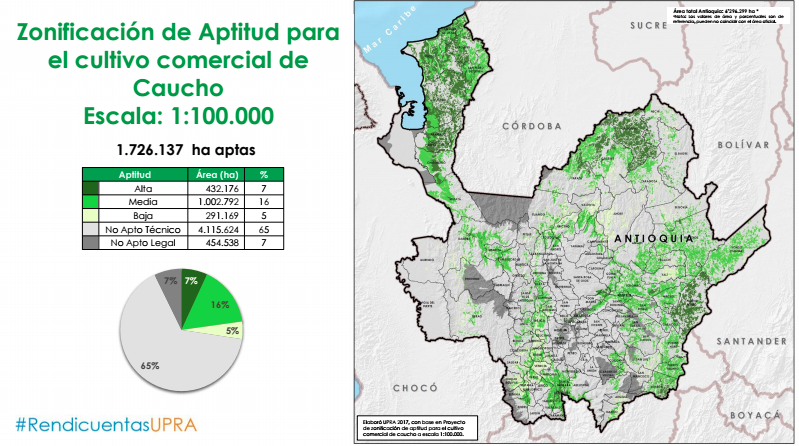

# Aptitud agrícola en Colombia
La [Unidad de Planificación Rural Agropecuaria - UPRA](http://upra.gov.co/), dentro de sus actividades de ordenamiento productivo, produce mapas de zonificación de cadenas productivas. Estos mapas permiten ver independientemente la aptitud para cada producto, la siguiente visualización pretende mostrar en un solo vistazo, la aptitud de todos los productos agrícolas encontrados su sistema de información ([SIPRA](http://upra.gov.co/SIPRA/)) relacionandola con cada uno de los departamentos. Esto permite identificar:

- Productos con aptitud en varios departamentos.
- Productos con baja aptitud en el territorio nacional.
- Departamentos con poca relación de aptitud de productos agropecuarios.
- Departamentos con aptitud para gran cantidad de productos agopecuarios.

Para mayor claridad, la siguiente imagen ilustra la forma de presentar la zonificación de aptitud de caucho en los mapas propuestos por la [UPRA](http://upra.gov.co/), mostrando las zonas con aptitud alta, media, baja, zonas no aptas o con exlusiones legales.

>_fuente: [https://drive.google.com/file/d/0B41eMRb76ohELXJUR2o0SzFITk0/view](https://drive.google.com/file/d/0B41eMRb76ohELXJUR2o0SzFITk0/view), más presentaciones en [https://sites.google.com/a/upra.gov.co/presentaciones-upra/](https://sites.google.com/a/upra.gov.co/presentaciones-upra/)_

## Convenciones del gráfico
**Nodos**
- Azul: Departamentos
- Naranja: Productos

**Enlaces**
- Color: Aptitud alta, media baja
- Grosor: porcentaje del área del departamento

## Hallazgos

- Las granjas avícolas es el producto con mayor aptitud desde el punto de vista de cantidad de departamentos y área de estos.
- El aguacate hass, por el contrario, es el que presenta menor aptitud en el territorio nacional.
- Aparecen departamentos sin aptitud para los productos presentados, estos son: San Andrés y Providencia, Vaupes, Guainía y Amazonas.
- Chocó presenta poca aptitud en porcentaje de área del departamento y cantidad de productos.
- Los departamentos con mayor aptitud son: Quindío, Córdoba, Sucre y Caldas.
- Magdalena presenta aptitud para varios productos agrícolas pero el área con mayor aptitud es para las gránjas avícolas.

### Más información
Para mayor información puede visitar el sitio web de la UPRA ([http://upra.gov.co/](http://upra.gov.co/)) o su [Sistema de Información para la Planificación Rural Agropecuaria - SIPRA](http://upra.gov.co/SIPRA/).

### Acceso a la visualización
Para Acceder a la visualización haga clic [Aquí](https://goo.gl/urpyYy).

