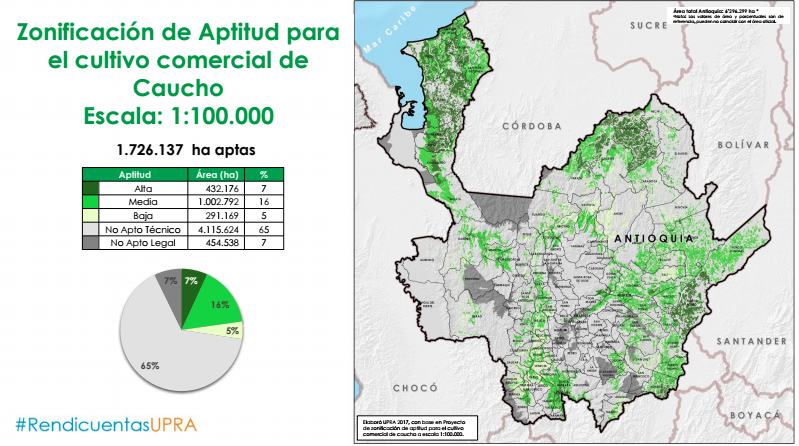

<link rel="stylesheet" href="https://maxcdn.bootstrapcdn.com/bootstrap/4.0.0-beta/css/bootstrap.min.css" integrity="sha384-/Y6pD6FV/Vv2HJnA6t+vslU6fwYXjCFtcEpHbNJ0lyAFsXTsjBbfaDjzALeQsN6M"
    crossorigin="anonymous">

<link rel="stylesheet" type="text/css" href="assets/css/main.css" />

# Aptitud agrícola en Colombia La [Unidad de Planificación Rural Agropecuaria - UPRA](http://upra.gov.co/), dentro de sus
actividades de ordenamiento productivo, produce mapas de zonificación de cadenas productivas. Estos mapas permiten ver independientemente
la aptitud para cada producto, la siguiente visualización pretende mostrar en un solo vistazo, la aptitud de todos los productos
agrícolas encontrados su sistema de información ([SIPRA](http://upra.gov.co/SIPRA/)) relacionandola con cada uno de los departamentos.
Esto permite identificar: - Productos con aptitud en varios departamentos. - Productos con baja aptitud en el territorio
nacional. - Departamentos con poca relación de aptitud de productos agropecuarios. - Departamentos con aptitud para gran
cantidad de productos agopecuarios. Para mayor claridad, la siguiente imagen ilustra la forma de presentar la zonificación
de aptitud de caucho en los mapas propuestos por la [UPRA](http://upra.gov.co/), mostrando las zonas con aptitud alta, media,
baja, zonas no aptas o con exlusiones legales.  >_fuente:
[https://drive.google.com/file/d/0B41eMRb76ohELXJUR2o0SzFITk0/view](https://drive.google.com/file/d/0B41eMRb76ohELXJUR2o0SzFITk0/view),
más presentaciones en [https://sites.google.com/a/upra.gov.co/presentaciones-upra/](https://sites.google.com/a/upra.gov.co/presentaciones-upra/)_
## Convenciones del gráfico **Nodos** - Azul: Departamentos - Naranja: Productos **Enlaces** - Color: Aptitud alta, media
baja - Grosor: porcentaje del área del departamento

<button id="sideBySide" type="button" class="btn btn-outline-primary btn-sm">Separación lateral</button>
<button id="radialDepartamento" type="button" class="btn btn-outline-success btn-sm">Radial departamentos</button>
<button id="radioAgricola" type="button" class="btn btn-outline-info btn-sm">Radial productos agrícolas</button>
<svg width="690" height="580"></svg>

    

        Nodos
        

            

Departamento
        

        

            

Producto agrícola
        

    

    

        Enlaces
        

            

Aptitud alta
        

        

            

Aptitud media
        

        

            

Aptitud baja
        

    

## Hallazgos - Las gránjas avícolas es el producto con mayor aptitud desde el punto de vista de cantidad de departamentos
y área de estos. - El aguacate hass, por el contrario, es el que presenta menor aptitud en el territorio nacional. - Aparecen
departamentos sin aptitud para los productos presentados, estos son: San Andrés y Providencia, Vaupes, Guainía y Amazonas.
- Chocó presenta poca aptitud en porcentaje de área del departamento y cantidad de productos. - Los departamentos con mayor
aptitud son: Quindío, Córdoba, Sucre y Caldas. - Magdalena presenta aptitud para varios productos agrícolas pero el área
con mayor aptitud es para las gránjas avícolas. ### Más información Para mayor información puede visitar el sitio web de
la UPRA ([http://upra.gov.co/](http://upra.gov.co/)) o su [Sistema de Información para la Planificación Rural Agropecuaria
- SIPRA](http://upra.gov.co/SIPRA/).
